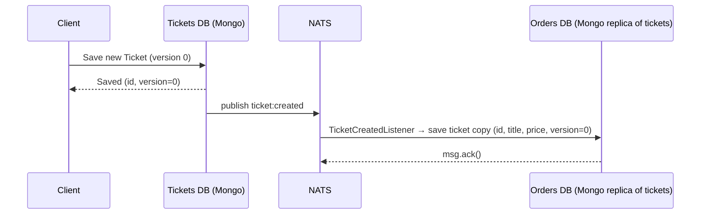
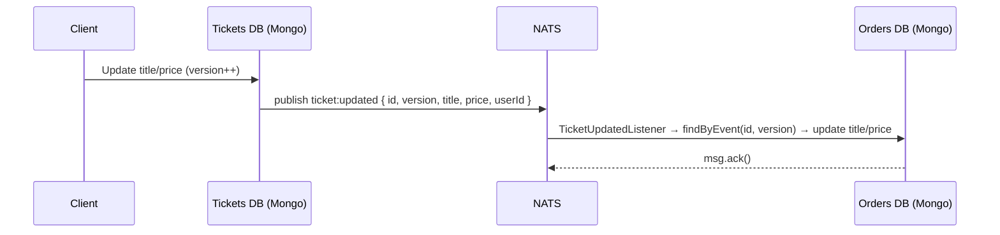
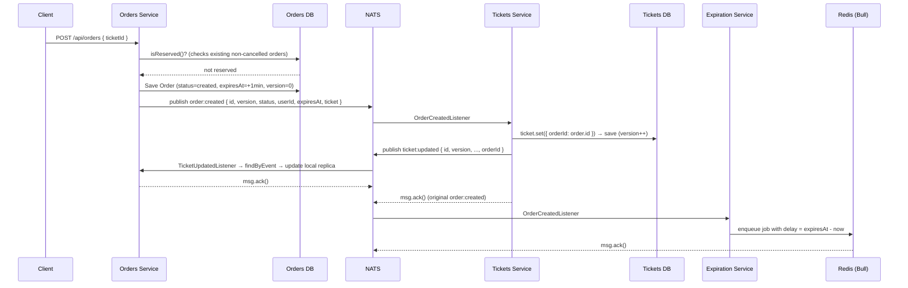
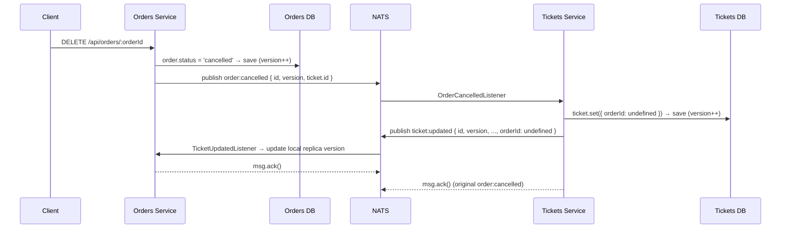
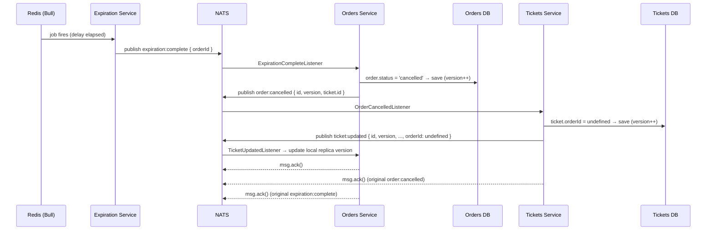
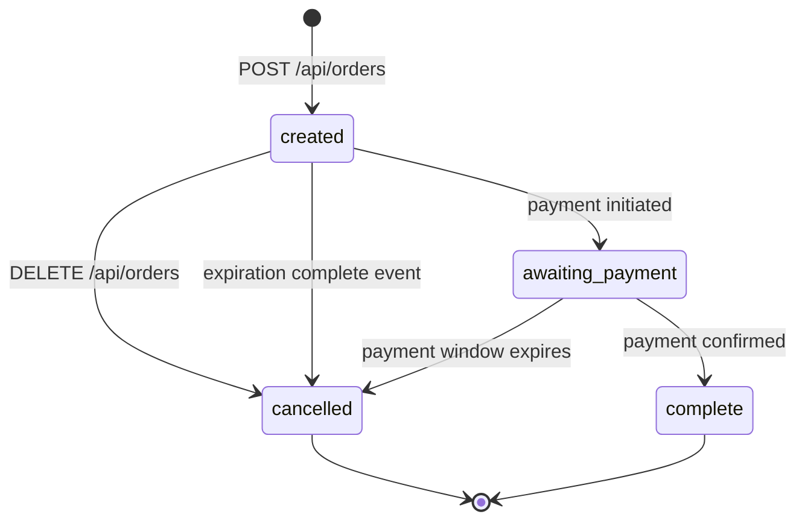

# Event Architecture Reference

This document describes the NATS Streaming event system used across the `tickets`, `orders`, and `expiration` microservices. All event contracts are defined in the shared `@charityx/common` package and consumed via the `Listener` and `Publisher` base classes.

---

## Contents

1. [Shared Infrastructure](#shared-infrastructure)
2. [Event Catalogue](#event-catalogue)
3. [Flow: New Ticket Posted](#flow-new-ticket-posted)
4. [Flow: Ticket Updated](#flow-ticket-updated)
5. [Flow: Order Created](#flow-order-created)
6. [Flow: Order Cancellation (User-initiated)](#flow-order-cancellation-user-initiated)
7. [Flow: Order Expiration](#flow-order-expiration)
8. [Ticket Version Management During Order Creation](#ticket-version-management-during-order-creation)

---

## Shared Infrastructure

The `@charityx/common` package (`common/src/events/`) provides:

| Item | Purpose |
|---|---|
| `Subjects` enum | Canonical NATS subject strings for all events |
| `Listener<T>` base class | Handles subscription setup, durable queue groups, manual ack, JSON parsing |
| `Publisher<T>` base class | Wraps `stan.publish` with a `Promise`-based API |
| Event interfaces | Typed data contracts for each subject |
| `OrderStatus` enum | Shared order state machine values |

### NATS Subscription Behaviour (common to all listeners)

Each `Listener` configures its subscription with:

- **Manual ack mode** — a message is only acknowledged after `msg.ack()` is explicitly called inside `onMessage`.
- **Durable subscription + queue group** — guarantees at-least-once delivery per queue group and that only one instance within a queue group processes each message.
- **Deliver all available** — a restarted service replays any unprocessed messages that arrived while it was down.

Queue group names per service:

| Service | Queue Group Name |
|---|---|
| `tickets` | `tickets-service` |
| `orders` | `orders-service` |
| `expiration` | `expiration-service` |

---

## Event Catalogue

### `ticket:created`

Published by the **Tickets** service when a new ticket is saved.

```ts
{
  id: string;
  version: number;   // starts at 0
  title: string;
  price: number;
  userId: string;
}
```

| Role | Service |
|---|---|
| Publisher | Tickets |
| Listener | Orders |

---

### `ticket:updated`

Published by the **Tickets** service whenever a ticket's fields or reservation state changes.

```ts
{
  id: string;
  version: number;   // incremented on every save
  title: string;
  price: number;
  userId: string;
  orderId?: string;  // present when ticket is reserved; absent when freed
}
```

| Role | Service |
|---|---|
| Publisher | Tickets |
| Listener | Orders |

---

### `order:created`

Published by the **Orders** service when an order is successfully created.

```ts
{
  id: string;
  version: number;
  status: OrderStatus;   // always 'created' at publish time
  userId: string;
  expiresAt: string;     // ISO 8601 UTC
  ticket: {
    id: string;
    price: number;
  };
}
```

| Role | Service |
|---|---|
| Publisher | Orders |
| Listeners | Tickets, Expiration |

---

### `order:cancelled`

Published by the **Orders** service when an order is cancelled — either by the user or by an expiration timeout.

```ts
{
  id: string;
  version: number;
  ticket: {
    id: string;
  };
}
```

| Role | Service |
|---|---|
| Publisher | Orders |
| Listener | Tickets |

---

### `expiration:complete`

Published by the **Expiration** service (via Bull/Redis delayed job) when an order's reservation window closes.

```ts
{
  orderId: string;
}
```

| Role | Service |
|---|---|
| Publisher | Expiration |
| Listener | Orders |

---

## Flow: New Ticket Posted

A user calls `POST /api/tickets`.



**What happens:**

1. `POST /api/tickets` saves a new `Ticket` document (Mongoose `optimisticConcurrency` sets `version = 0`).
2. `TicketCreatedPublisher` emits `ticket:created` with `{ id, version, title, price, userId }`.
3. The Orders service `TicketCreatedListener` builds a local replica of the ticket (id, title, price) and saves it to its own MongoDB — this replica is used when validating and pricing new orders.

---

## Flow: Ticket Updated

A user calls `PUT /api/tickets/:id`.



**What happens:**

1. The `PUT` handler rejects the request with `400 Bad Request` if `ticket.orderId` is set (ticket already reserved in an active order).
2. On save, Mongoose bumps `version` by 1.
3. `TicketUpdatedPublisher` emits `ticket:updated`.
4. The Orders `TicketUpdatedListener` looks up the local replica using `Ticket.findByEvent({ id, version })` — which queries for `version - 1` to enforce correct ordering — then updates `title` and `price`.
  It also persists `orderId` when present (reservation) and clears it when absent (unreservation), so replica version progression stays aligned with ticket lifecycle events.

---

## Flow: Order Created

A user calls `POST /api/orders` with a `ticketId`.



**What happens step by step:**

1. Orders service locates the local ticket replica, calls `isReserved()` (returns `true` if any `Order` with status `created`, `awaiting:payment`, or `complete` references this ticket).
2. An `Order` is persisted with `status = 'created'` and `expiresAt = now + 60 seconds`.
3. `OrderCreatedPublisher` emits `order:created`.
4. **Tickets service** (`OrderCreatedListener`): marks the ticket as reserved by setting `orderId = order.id`, saves it (version increments), then immediately emits `ticket:updated` carrying the new `orderId` and version.
5. **Orders service** (`TicketUpdatedListener`): receives the `ticket:updated` event and updates its local replica (`title`, `price`, and `orderId`) so version progression stays in sync for both reservation and unreservation paths.
6. **Expiration service** (`OrderCreatedListener`): calculates `delay = expiresAt - Date.now()` and enqueues a Bull job in Redis with that delay.

---

## Flow: Order Cancellation (User-initiated)

A user calls `DELETE /api/orders/:orderId`.



---

## Flow: Order Expiration

Triggered automatically when the Bull delayed job fires.



> **Note:** `ExpirationCompleteListener` does **not** check `order.status === 'complete'` before cancelling (that guard is currently commented out). If a payment flow is added, that guard should be reinstated to prevent cancelling a fully paid order.

---

## Ticket Version Management During Order Creation

Optimistic concurrency via the `version` field is the mechanism that prevents out-of-order event processing from corrupting data.

### How version increments

Both `Ticket` (tickets service) and the `Order`/`Ticket` models in the orders service use Mongoose's native optimistic concurrency (`optimisticConcurrency: true`). Every `document.save()` increments `version` by 1 atomically.

In the Orders service, the local ticket replica includes an optional `orderId` field and applies it from `ticket:updated` events. This ensures reservation-only updates are still persisted as state changes, which keeps subsequent `findByEvent` version matching correct.

### version timeline for a ticket during order creation

| Step | Actor | Action | Ticket `version` |
|---|---|---|---|
| 1 | Tickets service | `POST /api/tickets` — new ticket saved | 0 |
| 2 | Orders service | `ticket:created` received — replica saved | 0 |
| 3 | Tickets service | `order:created` received — `orderId` set, ticket saved | 1 |
| 4 | Tickets service | `ticket:updated` emitted (carries `version: 1`, `orderId`) | 1 |
| 5 | Orders service | `ticket:updated` received — `findByEvent({id, version: 1})` queries for `version = 0` ✓ | replica → 1 |

### Why `findByEvent` queries `version - 1`

```ts
// orders/src/models/ticket.ts
ticketSchema.statics.findByEvent = (event: { id: string; version: number }) => {
  return Ticket.findOne({
    _id: event.id,
    version: event.version - 1,  // must hold the previous version
  });
};
```

This ensures the Orders service only applies an update when it has already processed all prior updates for that ticket. If an event arrives out of order (e.g. version 3 arrives before version 2), `findByEvent` returns `null` and the listener throws — causing NATS to redeliver the message after the `ackWait` timeout (5 seconds).

### version timeline for a ticket during order cancellation / expiration

| Step | Actor | Action | Ticket `version` |
|---|---|---|---|
| — | (continuing from step 5 above) | | 1 |
| 6 | Orders service | `DELETE /api/orders` or expiration fires | — |
| 7 | Orders service | `order:cancelled` emitted | — |
| 8 | Tickets service | `order:cancelled` received — `orderId` cleared, ticket saved | 2 |
| 9 | Tickets service | `ticket:updated` emitted (carries `version: 2`, no `orderId`) | 2 |
| 10 | Orders service | `ticket:updated` received — `findByEvent({id, version: 2})` queries for `version = 1` ✓ | replica → 2 |

The ticket is now unreserved and available for a new order, with both services holding consistent `version: 2`.

---

## Order Status State Machine



| Status | Meaning |
|---|---|
| `created` | Order exists; ticket is reserved; awaiting payment |
| `awaiting:payment` | Payment in progress |
| `complete` | Payment confirmed; ticket fully sold |
| `cancelled` | Cancelled by user or expired before payment |
